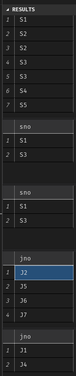

# Chapter 2
## 2.6
## 2.7
自然连接是以共享的分量为等值条件的等值连接, 同时额外使用投影去除重复分量
## 2.8
基本的操作有$\sigma, \times, \Pi ,-$
其余操作有(注意, 为了方便书写, 我们可以使用已经实现的算子实现其后的操作)

$$A \cap B = A - (A - B)$$
$$\neg A = U - A$$
$$ A \cup B = U - (\neg A)\cap(\neg B) $$ 
$$ A \bowtie_{cond} B = \sigma_{cond}(A \times B) $$
$$ A \bowtie B = \Pi_{attr(A) \cup attr(B)}(\sigma_{A[attr(A)\cap attr(B)] = B[attr(A)\cap attr(B)]}(A\times B)) $$

# Chapter 3
## 3.3

```sql
drop table if exists S;
drop table if exists T;

create table S(
  A int, 
  B int, 
  C int, 
  D int
);

create table T(
  C int,
  D int,
  E int,
  F int
);

insert into S values
(1, 2, 3, 4),
(2, 2, 3, 4),
(3, 2, 4, 4),
(1, 2, 4, 4);

insert into T values
(3, 4, 3, 4),
(4, 4, 3, 4),
(3, 2, 4, 4),
(1, 2, 4, 4);

-- 1
select * from S where A=10;

-- 2
select A,B from S;

-- 3
select * from S inner join T on (S.C=T.C and S.D=T.D);

-- 4
select A, B, S.C as C1, S.D as D1, T.C as C2, T.D as D2, E, F 
  from S inner join T on (S.C=T.C);

-- 5
select A, B, S.C as C1, S.D as D1, T.C as C2, T.D as D2, E, F 
  from S, T where (A<E);

-- 6
select TMP.C as C1, TMP.D as D1, T.C as C2, T.D as D2, E, F 
  from (select distinct C, D from S) as TMP, T;
```
## 3.4


